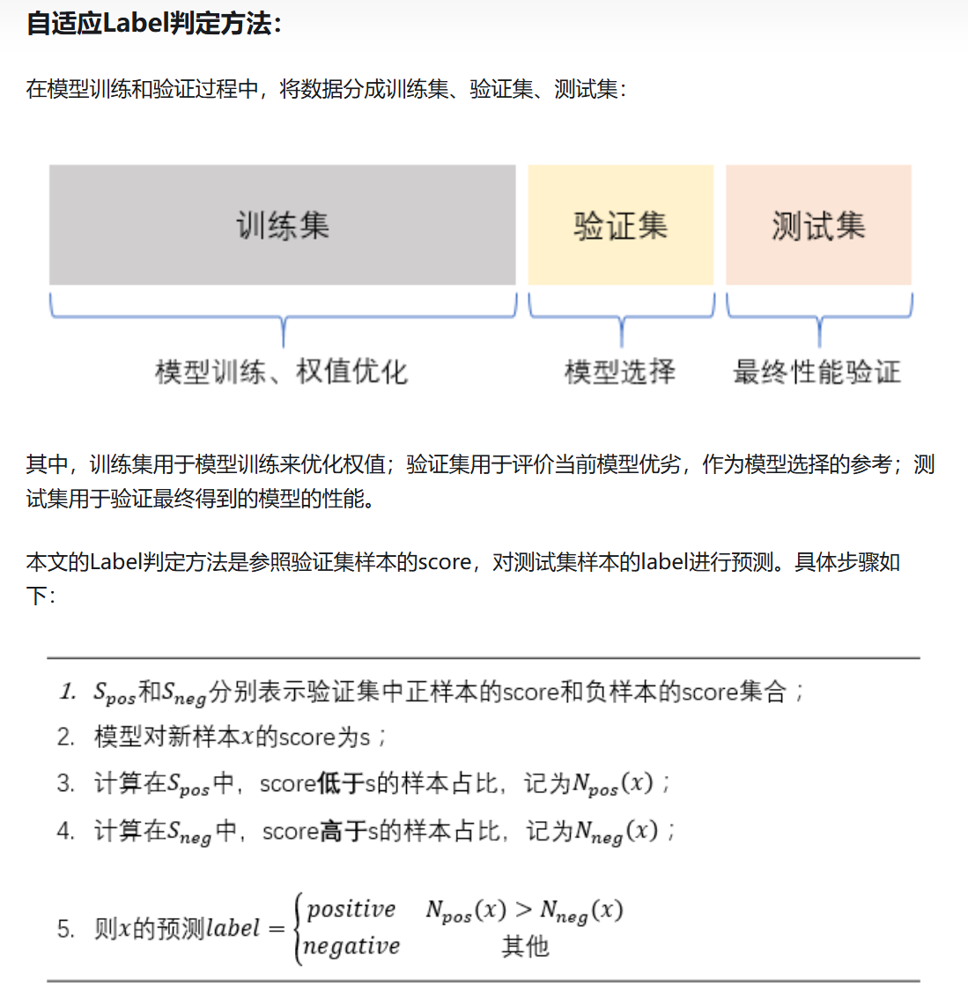
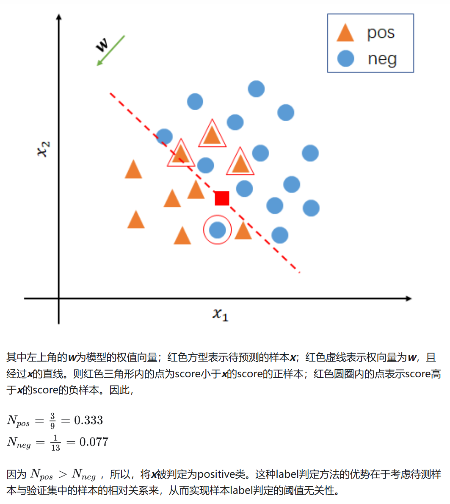

## 训练结果分类

> 起因是matlab中函数scores2label，用于将训练后数据的打分转化为标签，一般的做法是归一化处理后以0.5作为阈值

直观解释如上，最终判定 x（红色方形）为positive类（三角形）

参考链接：

[关于score到label的小想法：阈值无关的Label判定方法 - 知乎](https://zhuanlan.zhihu.com/p/384468609)