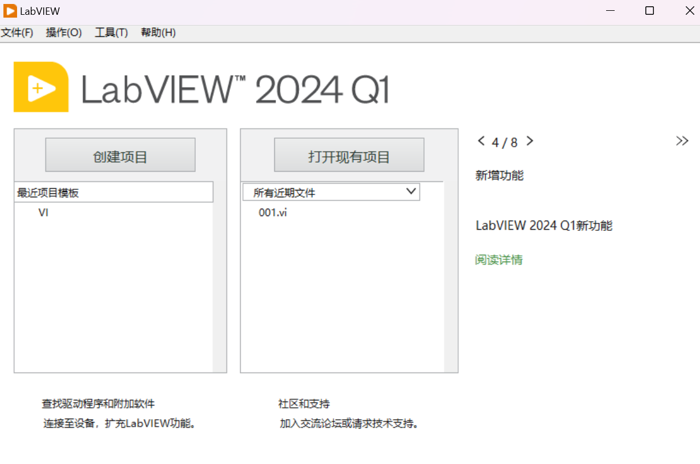
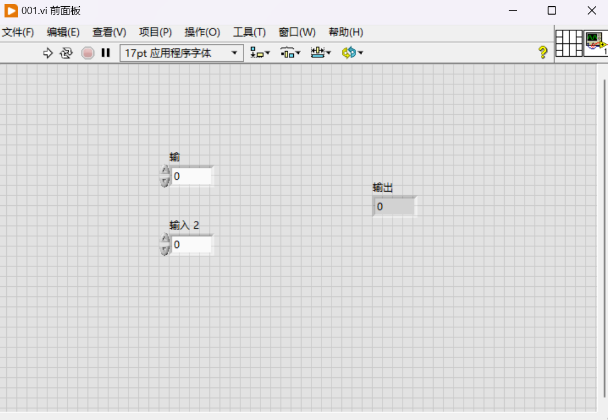
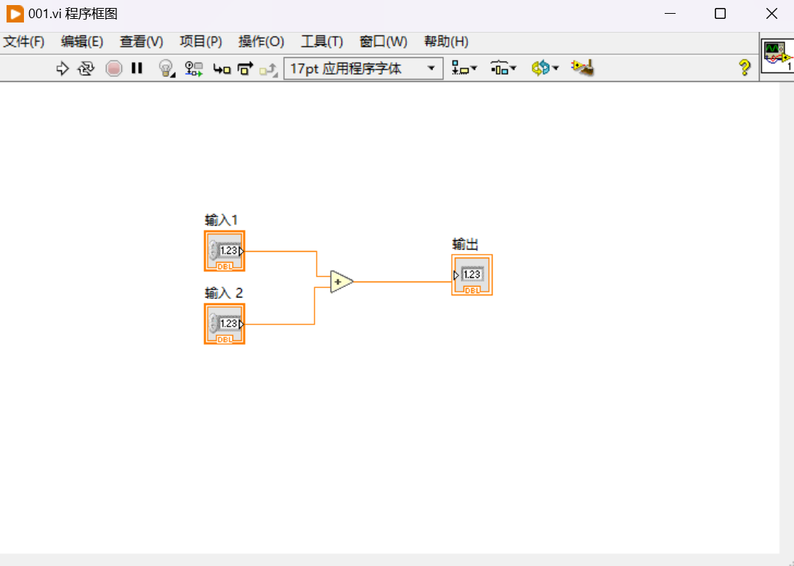
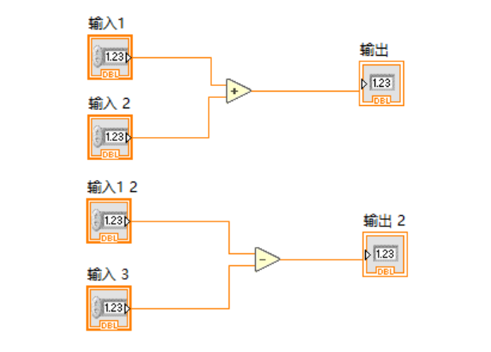

## Labview 基础

### 创建项目，选择VI模板

### 基本操作-快捷键

- Ctrl+D调出程序框图

- Ctrl+E切换程序框图和前面板

- Ctrl+B删除断线

- Ctrl+R运行

### 执行特点

- 并行运行

- 数据流
  - 平铺式顺序结构

<video src="./初识.assets/2025-02-21 17-11-59.mp4"></video>

参考链接：

[结合Labview使用python mathwork matlab c/c++ .NET](https://www.ni.com/zh-cn/shop/labview/using-python-matlab-and-c-with-labview.html)

[LabVIEW调用Matlab脚本-CSDN博客](https://blog.csdn.net/bojilan7484/article/details/135162130)

[博客园-Labview](https://www.cnblogs.com/anliux/p/16719376.html)

[NI官网教程](https://learn.ni.com/learn/article/labview-tutorial-simplifiedchinese#TARGET_1)

[官网使用手册 - NI](https://www.ni.com/docs/zh-CN/bundle/labview-api-ref/page/vi-lib/measure/macond-llb/fir-filter-for-1-chan-vi.html)

[LabVIEW Open Source Project · GitHub](https://github.com/LabVIEW-Open-Source)
