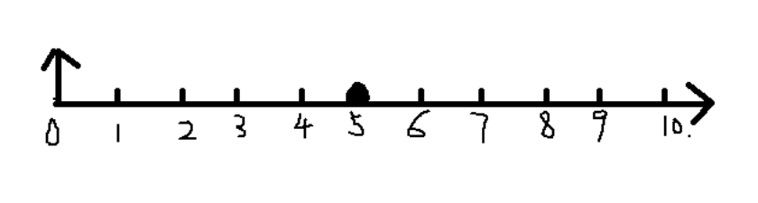
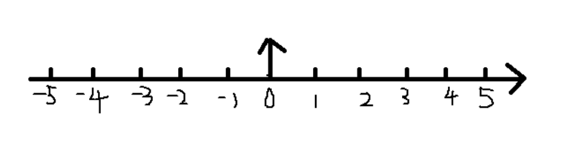

## FFT原理及应用

> 最近制作数据集时，为了降低数据特征维度，需要尽可能地提取数据中的有效成分，例如，使用单边谱、加窗计算以减轻频谱泄露。过程中发现自己对 FFT 的原理和使用方法还比较模糊，所以加深一下学习。

### 快速傅里叶变换FFT的频谱解析

>  根据奈奎斯特定律，采样频率应该大于奈奎斯特频率的2倍，奈奎斯特频率为在FFT频率中的定义如下，由于频谱对称性，$f=f_{max}/2$范围以内的正频谱可以看作有效信号频率

[为什么采样频率需要大于奈奎斯特频率的2倍？奈奎斯特采样定理（Nyquist） - MyCPlusPlus - 博客园](https://www.cnblogs.com/zoneofmine/p/10853096.html)

FFT计算得到的信号频谱，其频率坐标轴为：



上图中

$n=0$ 对应的频率是 $f_0 = 0$ ，为系统直流分量

$n=5$ 对应的频率是 $f_{max} / 2 = 0.5$ ，是系统能采集到的最大频率

显然整个频谱关于 $n=5$ 对称。

通过函数 $fftshift$ 将频率中心化，得到如下频谱：



上图，左边为负频率，右边为正频率。通过观察实际去中心化的频谱，发现正频率部分正好对应也是频谱的前半部分，所以可以用索引 $Y_{positive} = Y_0(1:L/2+1)$​ 来表示频谱中正频率部分

$n=5$ 表示的为奈奎斯特频率（Nyquist），即，序列 0~5 对应频率 0~0.5


参考链接：

[信号与系统：快速傅里叶变换FFT中的实际频率（奈奎斯特频率解析）-CSDN博客](https://blog.csdn.net/tyfwin/article/details/89840154)

[使用MATLAB绘制信号的单边谱和双边谱_matlab fft 双边频谱 单边频谱-CSDN博客](https://blog.csdn.net/m0_71343347/article/details/143782706)


### FFT算法原理

> FFT 并不是一种新的变换方法，而是加速 DFT 的运算，它还是 DFT

FFT 运算主要是在蝶形运算的基础上构成的

#### 码位倒序

> 二进制码位颠倒排序

| 自然顺序排列 $n$ | 二进制数 | 倒序二进制数 | 倒序顺序排列 $n'$ |
| :--------------: | :------: | :----------: | :---------------: |
|        0         |   000    |     000      |         0         |
|        1         |   001    |     100      |         4         |
|        2         |   010    |     010      |         2         |
|        3         |   011    |     110      |         6         |
|        4         |   100    |     001      |         1         |
|        5         |   101    |     101      |         5         |
|        6         |   110    |     011      |         3         |
|        7         |   111    |     111      |         7         |

在 MATLAB 中，对于一个序列 n ，可以通过一条语句计算出该序列码位倒序序列 n'

```matlab
nxd = bin2dec(fliplr(dec2bin([1:N] - 1, m))) + 1 ;
```

逐句作用如下：其中 N 是序列的长度；m 是 N 的 2 的幂次

```matlab
N = 8 ; m = 3 ; % 设置 N 和 m
x = 1 : N % 产生自然顺序序列
x1 = dec2bin(x-1,m) % x-1 后 十进制数转换成二进制数
x2 = fliplr(x1) % 把x1左右反转
x3 = bin2dec(x2) % 把x2二进制数转换成十进制数
y = x3 + 1 % x3+1后 输出
```

为了实现码位倒序计算从0开始，索引序列在计算倒序前先减1，转换完之后再加1

计算结果如下：

```
x = 1 2 3 4 5 6 7 8
x1 = 000 001 010 011 100 101 110 111
x2 = 000 100 010 110 001 101 011 111
x3 = 0 4 2 6 1 5 3 7
y  = 1 5 3 7 2 6 4 8
```

> 注意 x y 是 matlab 中相应数组的索引号，必须从1开始

#### 蝶形运算（有点复杂）

两节点的距离及 $W_N^r$ 的计算


### 案例：如何经 IFFT 后得到实数序列

> 理论基础
