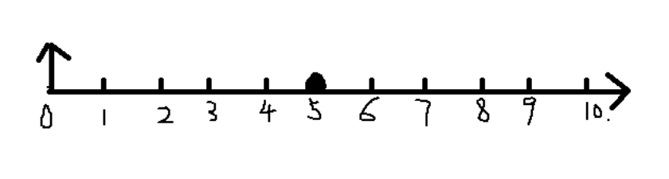

## 快速傅里变换FFT的频谱解析

>  根据奈科斯特定律，采样频率应该大于原始频率的2倍，因此，在$f=f_{max}/2$范围以内的信号才是有效信号

FFT计算得到的信号频谱，其频率坐标轴为：

上图中

$n=0$ 对应的频率是 $f_0 = 0$ ，为系统直流分量

$n=5$ 对应的频率是 $f_{max} / 2 = 0.5$ ，是系统能采集到的最大频率

显然整个频谱关于 $n=5$ 对称。

通过函数 $fftshift$ 将频率中心化，得到如下频谱：

上图，左边为负频率，右边为正频率。通过观察实际去中心化的频谱，发现正频率部分正好对应也是频谱的前半部分，所以可以用索引 $Y_{positive} = Y_0(1:L/2+1)$​ 来表示频谱中正频率部分

$n=5$ 表示的为奈奎斯特频率（Nyquist），即，序列 0~5 对应频率 0~0.5

参考链接：

[信号与系统：快速傅里叶变换FFT中的实际频率（奈奎斯特频率解析）-CSDN博客](https://blog.csdn.net/tyfwin/article/details/89840154)

[使用MATLAB绘制信号的单边谱和双边谱_matlab fft 双边频谱 单边频谱-CSDN博客](https://blog.csdn.net/m0_71343347/article/details/143782706)
