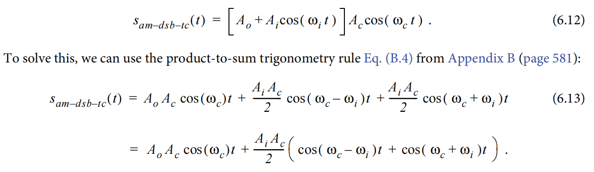

## 旋转机械振动分析

> 基于时间同步平均法的去噪算法，目标是齿轮故障的啮合频率边频（一般视为故障特征）

信号需要降噪的原因：**噪声干扰**、**传递路径衰减**、**多振源耦合**等因素

1. **滤波器降噪**：从不同的频率段中筛选出有用信号，如低通滤波、包络谱共振解调分析中的窄带滤波
2. **小波阈值降噪**：离散小波分析进行小波系数求解对信号进行分解与重构，可以平滑振动信号曲线，该滤波方法不易失真
3. **SVD降噪**：可以用于去除趋势项？
4. **EMD经验模态分解**：筛选本征核函数进行信号重构（EEMD可以更好的降低白噪声）

**在旋转设备平稳运行工况下**，适用于周期性变化特征，时域同步平均降噪方法可以很好的**降低宽频带的磨损信号**

### 数学原理

以整数周期的数据长度对信号进行分段，总共分为P段，其中第P段的信号表示为：
$$
y(k)=s(k)+s_n(k) \\
y_p(k')=y(k'+pzN_T)=s(k')+s_n(k'+pzN_T)
$$
式中$k'=1,2,...,zN_T$，$p=0,1,...,P-1$，$s(k')$为特征信号，$s_n(k')$为白噪声。分段过程，就像一个滑动的窗口，每隔一个周期就分一段。

将这P段信号相加，由于白噪声是不相干的，可以得到
$$
\sum\limits_{p=0}^{P-1}y_p(k')=Ps(k')+ \sqrt{P}s_n{k'}
$$
> 关于这里为什么是$\sqrt{P}$，涉及到随机信号的知识，由于特征信号在每个分段中是同步的，因此相加时幅度线性叠加，得到P倍的特征信号。对于白噪声，假设每个分段中的白噪声是独立同分布的，均值为0，方差为$\sigma^2$。当将Pge不相干的白噪声下相加时，总噪声的方差为各个方差之和，因此，总噪声的标准差（即幅度）为：$\sqrt{P \cdot \sigma^2}=\sigma \cdot \sqrt{P}$

可以设输出信号为：
$$
y'(k')=\frac{1}{P}\sum\limits_{p=0}^{P-1}y_p(k')
$$
应用时间同步平均法后，特征信号与白噪声的幅值体现出了差异，具体如下：
$$
y'(k')=s(k')+\frac{1}{\sqrt{P}}s_n(k')
$$
输出信号中的白噪声与原始信号中白噪声的$\frac{1}{\sqrt{P}}$​倍，**信噪比（Signal to Noise Ratio, SNR）**则提高到了P倍。

### 时域同步平均

Matlab关于旋转机械的振动分析案例，在本地Matlab实时脚本上已跑通，主要学习到，**时间同步平均法**有助于对故障齿轮位置和类型的分析

利用Matlab进行仿真，有一个没有学会，就是自己生成仿真数据

补充一下幅值调制信号的公式：$Y(t)=[A_0+m(t)]*cos(2 \pi f_c t)$，其中$m(t)$为调制频率，$f_c$为载波频率，$A_0$为直流偏置，调幅系数 $a=\frac{|m(t)|_{max}}{A_0}$。下面的算法案例中 $m(t)$ 幅值为2​，意味着调制后的子信号的频率（边频）幅值与载波频率幅值一致。



> 技术方面可以多看博客，深入到原理就一定要参考更权威的书籍或论文

```matlab
% 时域同步平均
XTime = 0.001:0.001:5000;  % 这里的0.001为时间分辨率
fs = 1000;  % 采样频率
% 构建仿真信号
YTime = (1+2*sin(10*pi*XTime)).*cos(100*piXTime);  % 幅值调制的算法公式
% 以上这个式子计算得到的仿真信号频谱为50Hz频率以及其两侧45Hz和55Hz的边频
% 幅度调制信号，载波信号为50Hz，调制信号为5Hz
% 根据信号频率，一个信号周期为0.02s/0.2，一个信号周期内对应的采样时间点数为20/200个
% 构建时间同步的分段窗口时，只需要等于特征信号周期的整数倍？（但是目前来看看4000=20*200）
% Matlab案例中对于TSA的应用并未涉及调制信号，只是简单的信号叠加（不同频率的子信号）
z = 10*randn(1,5000000)  % 学习一下怎么生成白噪声
z = z-mean(z);  % 白噪声，平均值为0，已知原始信号幅值为1，平均化后的白噪声幅值时原始信号的5倍
YTime = YTime+z;
% 这个案例，关于分段长度的确定，没有理论上的解释
M = 4000;
% 可以理解为分段时滑动窗口的左右指针（索引）
m1 = 1; m2 = M
% 确定分段数
N = length(XTime);  % 信号总长度
NTime = fix(N/M);  % 按最小整数取整
% 滑动窗口分段
x_TSA = zero(1,M);
for i=1:NTime
	x_T = YTime(m1:m2);
	x_TSA = x_TSA+x_T;
	m1 = m1+M;
	m2 = m2+M;
end
% 记得最后对叠加的分段计算平均
x_TSA = X_TSA/NTime;

% 计算频域的时候未来方便对比可以取等长信号
fft1 = fft(YTime(1:M));
fft2 = fft(x_TSA);
```

### 角度域同步平均

> PSA 角度同步平均，需要将一转内的数据按角度域重采样，然后平均。

多周按角度的去平均角域信号，与时间同步平均法原理相似，只是在角度域进行分段，关于角度域是什么，需要进一步学习阶比分析。

对于一段变速工况下采集的振动信号，信号呈现非稳态，如何可以将变速非稳态信号转化成稳态信号？可以通过等角度采样。

**等角度采样**：即对时域采样信号进行等角度采样，将等时间采样的非平稳信号转换为等角度采样的平稳信号。

```matlab
%% 变转速 PSA(phase synchronous average)角度域同步平均：先等角度采样，然后同步平均
fs = 500;
t = 0:1/fs:20;
f0 = 1;
f1 = 20;
rpm = 60*linspace(f0,f1,length(t));
y = exp(-0.1*t).*chirp(t,f0,20,f1,'linear');
plot(t,y)

[xp,fsp,phaseUp,rpmUp,timeUp,constPhase] = phase_sampling(y,fs,rpm,t);
% fsp 为角度采样率，函数参考matlab中的toConstantSamplesPerCycle函数

Index = constPhase(fsp+1:fsp:end)  % 每转脉冲对应的相位序列，此处constPhase为转数
% 上式基于转数进行等角度采样，fsp为角度采样率，因此，序列之间，有相同的角度间隔，而时间间隔不同

[TA,T,P,RPM] = tsa(xp,fsp,Index,'NumRotations',10);  % 时间同步平均

plot(T,TA)
```

#### 时域到角度域的转换

下面学习一下Matlab中的`toConstantSamplesPerCycle`函数，主要用于时域到角度域的转换：

```matlab
% matlab中的toConstantSamplesPerCycle函数
function [xp, fsp, phaseUp, rpmUp, timeUp] = toConstantSamplesPerCycle(x,fs,rpm,time)

% Compute the maximum order that can be present in X with no aliasing. Max
% frequency, fmax, is the signal's max frequency (max(rpm/60)) multiplied
% by max order. For Nyquist to hold fs > 2*fmax = 2*max(rpm/60)*Omax.
% 这里用到奈奎斯特理论，住重点理解一下Omax，应该是指最大阶次（一圈内发生次数最多的事件）
Omax = fs/(2*max(rpm/60));

% Define sampling rate (samples/cycle) in phase domain based on the maximum
% order. Make sampling rate 4 times the Nyquist rate in the order domain.
fsp = 4*(2*Omax);  % 角度采样率是奈奎斯特比率的4倍

% Define upsample factor. Upsampling will improve accuracy when converting
% from constant samples/second to constant samples/cycle. In the worst case
% scenario, when time signal is critically sampled in time at Fmax/2, we
% are increasing the Nyquist frequency by 15.
upFactor = 15;  % 上采样可以提高采样精度，这里上采样了15倍

% Upsample x and rpm
if isa(x,'single')  % 这里考虑到不同的数据格式
  xtemp = resample(double(x),upFactor,1);
  xUp = single(xtemp);
else
  xUp = resample(x,upFactor,1);
end

% Get upsampled time and rpm vectors
% 为什么用 .' 而不是 '？
% ' 是共轭转置（对复数数据会取共轭），而 .' 是普通转置。
% 如果数据是实数，两者效果相同；若数据是复数，需注意差异。
timeUp = (0:length(xUp)-1).'/(upFactor*fs);  % 时间序列上采样，按原来的采样率的up倍数
rpmUp = interp1(time, rpm, timeUp, 'linear','extrap');  % 在更细的横坐标上进行线性插值

% Estimate the phase of each signal sample by integrating the instantaneous
% signal frequency which is rpmUp/60. Divide by sampling rate which is
% upFactor*fs;
phaseUp = cumtrapz(rpmUp/(60*upFactor*fs));  % upFactor*fs仍然是从时域进行上采样
% 转频 / 采样率 = 每采样点瞬时相位
% phaseUp 代表上采样之后，信号的时域累计相位（时间采样点），长度与timeUp rpmUp一致

% Interpolate signal x at constant phase increments (i.e. constant
% samples/cycle). xp is uniformly sampled in the rotational domain --> same
% samples per rotation for any rpm. Use only strictly increasing values of
% phaseUp (values may not be unique for very small or very large rpm
% inputs).
constPhase = (phaseUp(1):1/fsp:(phaseUp(end)))';  % 以角度采样率重新计算常量相位
strictincrIdx = [true; diff(phaseUp) > 0];  % 相位大于零的序列
phaseUp = phaseUp(strictincrIdx);
rpmUp = rpmUp(strictincrIdx);
timeUp = timeUp(strictincrIdx);
xp = interp1(phaseUp, xUp(strictincrIdx), constPhase, 'linear','extrap');  % 根据角度域序列，对时域信号进行下采样，其中xUp为原始信号x上采样15倍的结果
end
```

#### 1. cumtrapz函数功能

`cumtrapz` 是 MATLAB 中的**累积梯形数值积分函数**，其作用是对输入信号进行**逐点累积积分**。具体来说：

- **输入**：一个向量或数组（例如 `rpmUp/(60*upFactor*fs)`）。
- **输出**：与输入等长的数组，每个点的值是输入信号从起点到当前点的**积分结果**（即“面积”累积和）。
- **计算方法**：采用梯形法（Trapezoidal Rule）近似计算积分，适合离散信号。

**示例**：
若输入为 `[y1, y2, y3]`，则输出为：
`[0, (y1+y2)/2 * Δt, (y1+y2)/2 * Δt + (y2+y3)/2 * Δt]`
（其中 `Δt` 是采样间隔时间）。

>`rpmUp/(60*upFactor* fs)`的表示**每采样点的相位增量（转/采样点）**，即每采样点转过的圈数，如0.02圈；`upFactor* fs`就可以理解为每圈的采样点数；通过`cumtrapz`积分，进行相位增量累计，得到总相位。我是这么理解的，因为`rpmUp`是变化的转速，每个采样点对应的是当前转速下的**瞬时相位**（可以先从匀速来理解，采样点p1-p2，转过0.02圈），因此若要计算**总相位**（累计相位），就需要对`rpmUp/(60*upFactor* fs)`进行积分。注意如果要转化为弧度就需要乘以`2π`

#### 2. resample函数概述

`resample`是MATLAB中对时间序列进行重采样的函数

`x` - 待重采样的时间序列；
`p` - 重采样之后目标频率；
`q` - 待重采样的时间序列频率.

1. **插值（Upsampling）**
   - 先在原始信号每两个样本间插入 `upFactor-1` 个零值，将序列长度扩展为 `upFactor * length(x)`。
   - 例如：原始信号 `x = [x1, x2]`，`upFactor=2` → 插入零后变为 `[x1, 0, x2, 0]`。
2. **抗镜像滤波（Anti-Imaging Filter）**
   - 插零会引入高频镜像分量（频谱周期性延拓）。
   - 通过抗混叠的低通滤波器（默认使用 Kaiser 窗设计的 FIR 滤波器）滤除这些高频分量，保留原始信号的频带。
   - 滤波后，零值被替换为插值后的合理幅度值，实现平滑过渡。
3. **增益调整**
   - 滤波后的信号可能幅度衰减，因此通常会乘以 `upFactor` 补偿能量损失。

### 阶比分析

阶比分析对信号进行等角度采样，每一圈采样的点数是一样的，而且位置不变。阶比分析的结果，行坐标表示阶比，纵坐标表示幅值强度。阶比的定义是参考轴每转的波动次数（比如冲击事件发生的次数，幅值为冲击强度）。

Matlab阶比分析首先需要调用`tachorpm`函数对专属脉冲信号进行预处理，得到转速曲线`rpm`

观察视角不同，对于变速状态的信号数据，不同时间段的脉冲信号个数是不同的。

等时间采样对应的采样频率是不变化的，随着转速变化，每一圈的采样点数减少

振动信号的阶次分析在MATLAB实时脚本上已跑通

参考链接：

[旋转机械的振动分析](https://ww2.mathworks.cn/help/signal/ug/vibration-analysis-of-rotating-machinery.html#RotatingMachineryv2Example-1)

[时域同步平均TSA-Matlab-学习笔记-CSDN博客](https://blog.csdn.net/weixin_40676428/article/details/126167067?spm=1001.2014.3001.5502)

[时域同步平均(TSA)算法 - Python - 知乎](https://zhuanlan.zhihu.com/p/695449234)

[TSA（time synchronous averaging）和PSA(phase synchronous averaging) - 知乎](https://zhuanlan.zhihu.com/p/453201777)