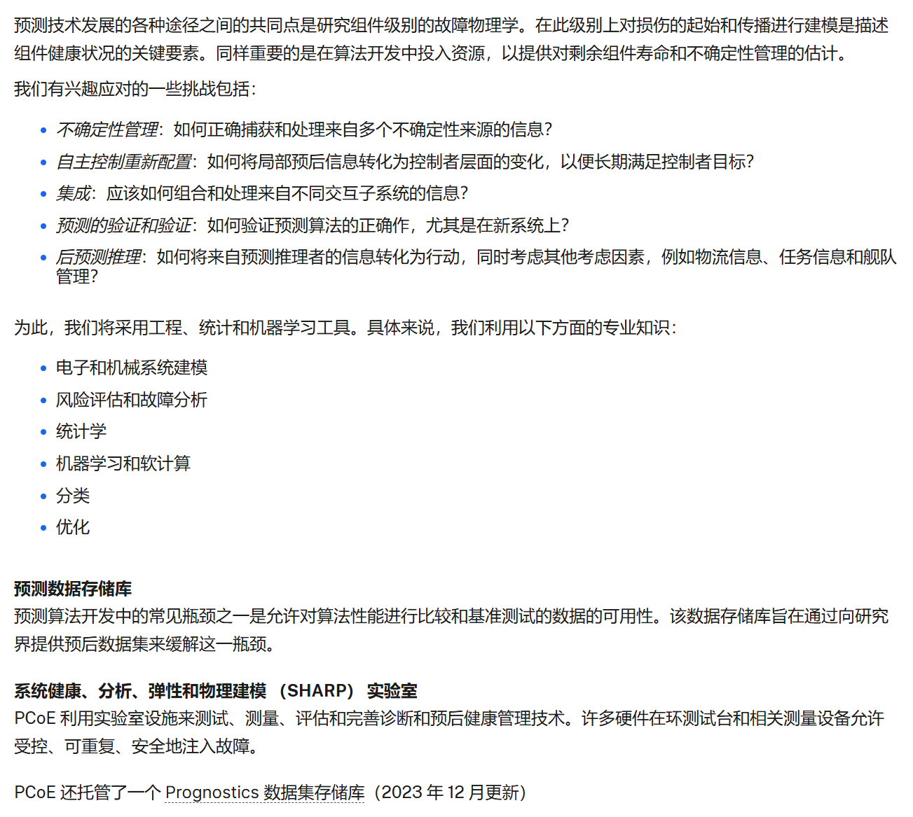

## 开源数据集

### NASA 开源数据集

[Prognostics Center of Excellence - NASA](https://www.nasa.gov/intelligent-systems-division/discovery-and-systems-health/pcoe/)

组件级别的故障物理学

1. Algae Raceway 生物与能源
2. Carbon Fiber-Reinforced Ploymer (CFRP) Composites 材料与结构
3. Milling
4. Bearing
5. Battery 电池
6. Turbofan Engine Degradation Simulation 航空涡轮发动机退化模拟
7. Prognostics Health Management 8 (PHM08) Challenge
8. Insulated-Gate Biopolar Transistor (IGBT) Accelerated Aging 电子元器件老化与可靠性
9. Trebuchet
10. FEMTO Bearing
11. Randomized Battery Usage
12. Capacitor Electrical Stress 电容器电应力测试
13. Metal-Oxide-Semiconductor Field-Effect Transistor (MOSFET) Thermal Overstress Aging
14. Capacitor Electrical Stress-2
15. High-Intensity Radiated Field (HIRF) Battery 高清都辐射场对电池的影响
16. Small Satellite Power Simulation 卫星与航天器系统
17. Turbofan Engine Degradation Simulation-2
18. Fatigue Crack Growth in Aluminum Lap Joint 铝接头疲劳裂纹
19. CNC Milling Machine
20. Anemometer 风速计
21. Wafer Chemical-Mechanical Planarization 晶圆化学机械平坦化？

