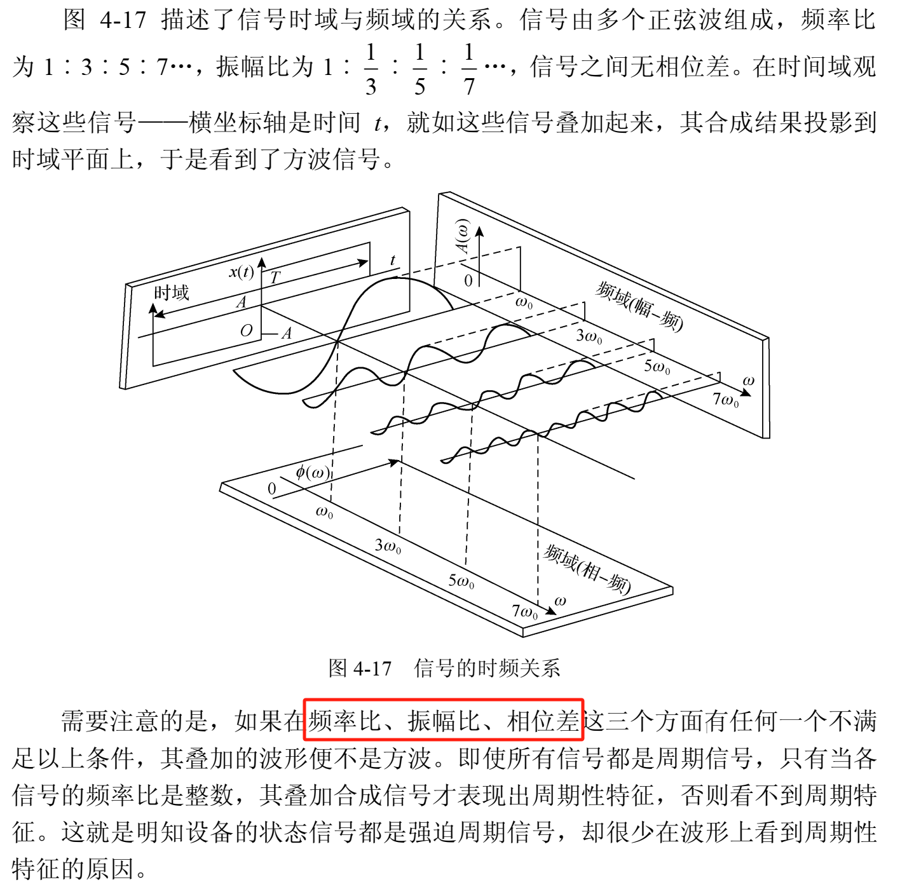
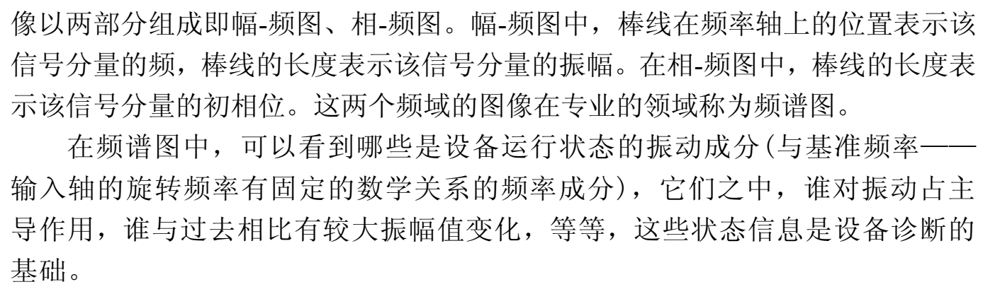
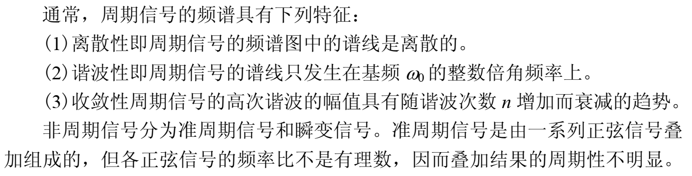
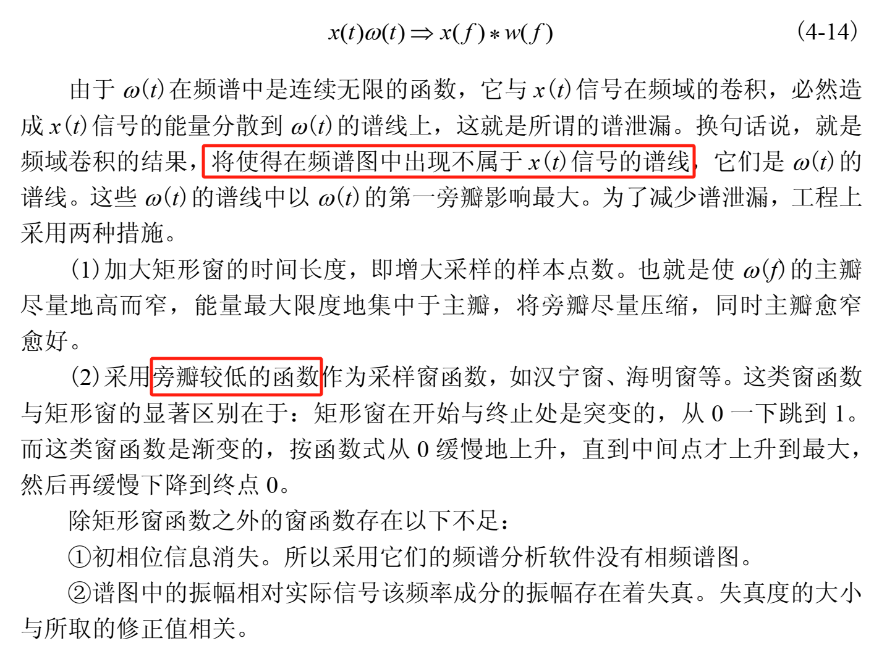
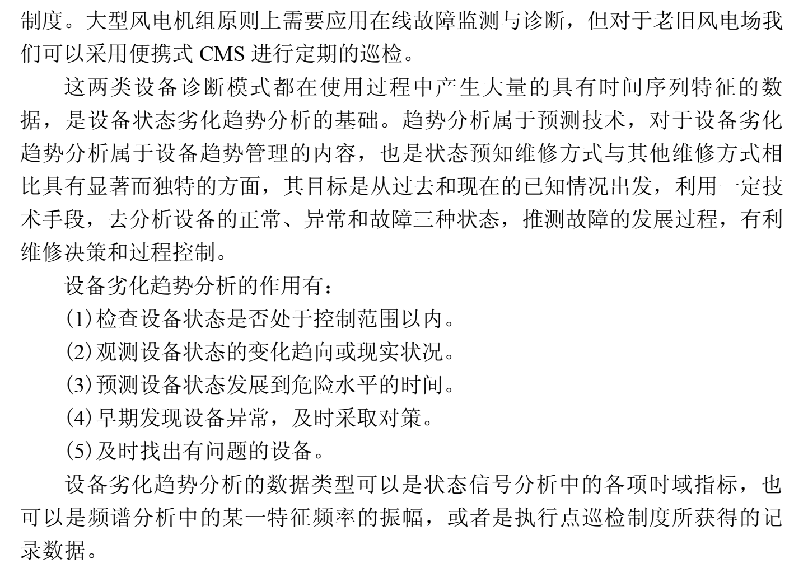
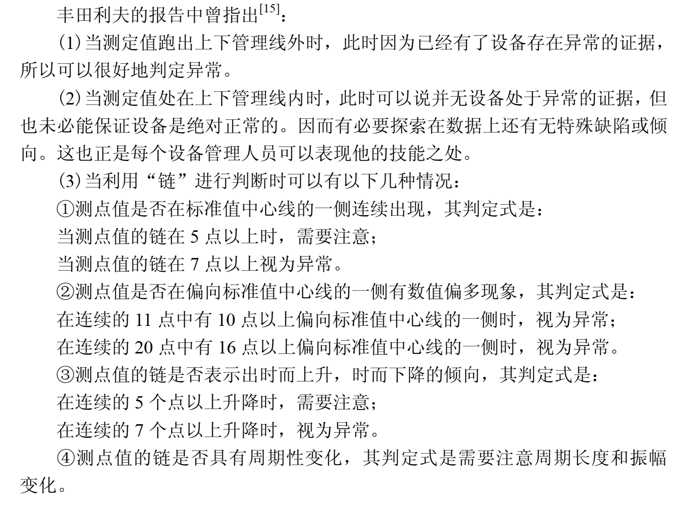

## 基于便携式CMS的风机组状态评价

> 初步判断风机组运行的基本状态：时域指标、频域频谱特征和振动趋势分析

### 状态评价的时域指标介绍

> 一个好的Indicator是严格随时间单调的，基于一个好的Indicator加上一些机器学习或者神经网络去做故障分类才会精准可靠。

参照 **王奉涛的滚动轴承故障诊断于寿命预测**

> 均方根值RMS、峭度K、波峰因子Crest、峰峰值P-P、脉冲因子Impluse、裕度因子Margin、波形因子W、时域信息熵Ht、总功率谱Gt、莱斯频率fx、频率重心fc、频率方差Vf、谐波指标H、均方频率MSF、频域信息熵Hf，构建多个敏感指标对于后期的指标融合是极其关键的，因为如果指标本身对故障并不敏感，后期融合后也达不到期望的效果

1. **平均值**

   描述信号的稳定分量，直流分量：

   **平均值** $\overline X = \frac{1}{N}\sum\limits^N_{i=1}x_i(t)$​

   传感器：涡流传感器；安装初始间隙构成初始信号平均值（初始直流电压分量）；风机运行过程中，轴心位置变动产生轴心位置的振动信号，轴心位置的平均值于初始信号平均值的插值，可以反映轴瓦的磨损量。

2. **均方值、有效值**

   描述振动信号的能量：

   **均方值** $X^2_{rms} = \frac{1}{N}\sum\limits^N_{i=1}x^2_i(t)$​

   当有效值$X_{rms}$（均方根值，速度mm/s），超出正常值（故障判定限）较多时，存在故障；用于判定旋转机械状态等级的振动烈度指标。

3. **峰值、峰值指标**

   指振动波形的单峰最大值，时不稳问题，为了提高峰值指标的稳定性：找出绝对值最大的10个数，用着10个数的算数平均值作为峰值$X_p$

   **峰值指标** $I_p = \frac{X_p}{X_{rms}}$ 峰值指标$I_p$和脉冲指标$C_f$均用于检测信号中是否早有的冲击成分

4. 脉冲指标（逐渐被峭度指标所替代）

   脉冲指标 $C_f = \frac{X_p}{\overline x}$

5. **裕度指标**

   用于检测旋转机械设备磨损情况

   **裕度指标** $C_e = \frac{X_{rms}}{\overline x}$​

   歪度指标不大的情况下，裕度指增大，说明磨损导致间隙增大（有效性比平均值增加快）

6. **歪度指标**

   反映振动信号非对称性

   **歪度指标** $C_w = \frac{\frac{1}{N} \sum\limits^N_{i=1}(|x_i|-\overline x)^3}{X^3_{rms}}$​

   除有急回特性的转动设备外，由于存在着某一方向的摩擦或碰撞，造成振动波形的不对称，使歪度指标增大

7. **峭度指标**

   反映信号的冲击特征

   $C_q = \frac{\frac{1}{N} \sum\limits^N_{i=1}(|x_i|-\overline x)^4}{X^4_{rms}}$​

   正常情况下其值应该在3左右，如果这个值接近4或者超过4，说明旋转机械的运行中存在冲击向振动（一般是间隙过大、滑动副表面存在破碎等）

> 以上指标不能孤立地看，需要互相印证，同时注意和历史数据进行比较，根据趋势曲线作出判别。
>
> 实际风电机组运行中，发现某项或多项特征指标上升，但风机组不能停产检修，只能带病运行。当这些指标从峰值跌落时，往往预示某个零件已经损坏，若这些指标（含其他指标）再次上升，则可能预示大的风电机组故障将要发生。

### 状态评价的频域特征描述

> 时域统计特征指标一眼用于故障监测、趋势预报，频谱分析则可以用于分析故障的部位及类型

机械设备运行过程中发出的振动信号来自多个振动源，这些信号在传输通道中叠加，被传感器转换成单一的电信号。

1. **频域分析与时域信号的关系**

> 初相位对信号的影响？

2. **周期信号与非周期信号的频谱**

3. **截断、泄露与窗函数**

**谱泄露**：信号采样过程中，对无限长的信号进行截取，也即对信号乘以窗函数，信号与窗函数在频域的卷积，造成信号的能量分散到窗函数的谱线上。

### 状态的判定与趋势分析

> 链是由连续出现在标准值的某一侧的测点值所构成的。链的长度为连续出现在标准值一侧测点值的个数。

