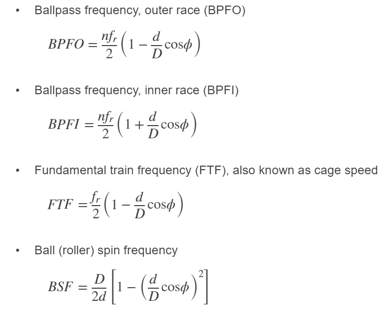

## 故障特征频率计算公式

> 好的，我现在要解决用户的问题：“轴承计算公式中的接触角是弧度值吗？”首先，我需要确认接触角在轴承计算中的定义以及常见的单位。接触角通常是指滚动轴承中滚动体与内外圈接触点的法线方向与径向平面之间的夹角。这个角度对于轴承的承载能力、寿命计算等非常重要。
>
> 接下来，我需要回忆一下接触角在相关公式中的使用情况。例如，在计算轴承的轴向载荷和径向载荷的关系时，接触角是一个关键参数。这时候，问题来了：这个角度在公式中是使用度数还是弧度？
>
> 一般来说，工程计算中角度有两种表示方式：度数和弧度。在数学和物理的许多公式中，尤其是涉及三角函数的时候，通常使用弧度，因为弧度是国际单位制（SI）的导出单位，而度数不是。例如，sin、cos等三角函数在大多数科学计算中默认使用弧度作为输入。
>
> 但实际工程应用中，情况可能有所不同。接触角通常在轴承的技术规格中以度数给出，比如15度、25度等。工程师在设计计算时可能更习惯于使用度数，但需要转换为弧度以适应公式中的三角函数计算。因此，可能存在两种情况：公式明确要求使用弧度，或者公式接受度数但需要根据计算器或软件设置进行调整。
>
> 我需要查阅一些轴承计算的参考资料或教材，确认接触角的具体单位使用情况。例如，在《滚动轴承分析》这类专业书籍中，接触角的计算公式是否使用弧度。另外，一些标准如ISO 281中关于轴承寿命计算的公式，是否涉及接触角，并明确单位。
>
> 假设在某个轴承的载荷分布公式中，接触角α出现在cosα或sinα中，这时候如果公式中的角度参数没有特别说明，可能需要确认单位。如果公式是理论推导自微分方程或积分，那么很可能使用弧度，因为微积分中的角度都是以弧度为单位的。但如果是应用型的经验公式，可能直接使用度数，尤其是当公式中的系数已经根据度数调整过的情况下。
>
> 此外，还需要考虑计算时的工具。如果使用计算器或编程语言（如Python、MATLAB），三角函数函数通常默认使用弧度，所以如果接触角以度数给出，需要先转换为弧度。例如，在Excel中，SIN函数需要弧度，因此必须将度数转换为弧度，或者使用RADIANS函数转换。
>
> 不过，也有可能某些工程领域的公式已经将度数直接纳入考虑，即公式中的系数已经根据度数进行了调整，这样使用时可以直接输入度数而无需转换。这需要具体问题具体分析，可能需要查阅具体的公式来源或标准。
>
> 总结起来，可能的结论是：接触角在理论公式中通常使用弧度，因为涉及三角函数，但在实际工程应用中，接触角常以度数给出，因此在代入公式前需要转换为弧度。但需要根据具体的公式和标准来确定，有些情况下可能直接使用度数，尤其是当公式已经被经验性调整过的情况下。
>
> 现在需要验证这个思路是否正确。例如，查看具体的轴承计算公式，如Stribeck的载荷分布公式，或者Lundberg-Palmgren的寿命公式，是否明确接触角的单位。假设在Lundberg-Palmgren公式中，接触角α用于计算等效动载荷，此时可能需要使用弧度，但如果接触角的值通常以度数给出，则必须转换。
>
> 另外，可以举一个例子：假设接触角α=15度，在计算cosα时，如果直接用15度计算，得到的cos(15°)≈0.9659；而如果误将15弧度代入，cos(15)≈-0.7595，结果会完全错误。因此，正确使用单位至关重要，需要确认公式中的角度单位。
>
> 因此，正确的做法是：在轴承计算公式中，如果接触角作为角度参数出现在三角函数中，应该使用弧度，但实际应用中通常需要将度数转换为弧度再进行计算。但具体情况仍需参考具体公式的定义，可能存在例外。
>
> 最后，用户的问题可能源于实际计算中遇到了结果不符的情况，或者在学习过程中对单位产生疑惑。因此，明确回答时需要指出一般情况下是否需要转换，并强调查阅具体公式说明的重要性。

在轴承计算公式中，接触角的单位通常取决于具体的公式和上下文，但需注意以下几点：

1. **理论公式中的单位**：  
   在涉及三角函数（如 $\cos\alpha$、$\sin\alpha$）的**理论推导公式**中，接触角 **默认以弧度为单位**，因为国际单位制（SI）要求数学函数中的角度使用弧度。例如，微分方程或积分中的角度参数必须为弧度。

2. **工程应用中的常见做法**：  
   实际工程中，接触角通常以**度数**给出（如 $15^\circ$、$25^\circ$）。若公式未明确单位，需将度数转换为弧度后再代入计算。例如：  
   $$\alpha_{\text{rad}} = \alpha_{\text{deg}} \times \frac{\pi}{180}.$$

3. **特殊情况与标准**：  
   某些经验公式或行业标准（如 ISO 281）可能直接采用度数，并已通过系数调整兼容。此时需严格遵循公式说明，**无需额外转换**。

4. **验证方法**：  
   - 若接触角值直接代入三角函数（如 $\cos(15)$），结果为弧度计算，需确认输入是否为15度（应转换为约0.2618 rad）。  
   - 检查公式来源或标准文档，明确单位要求。

**结论**：  
在大多数理论公式中，接触角应转换为弧度；但在实际工程中，需根据公式定义判断。**关键步骤为：**  
1. 确认公式是否隐式要求弧度；  
2. 若接触角以度数给出，先转换为弧度（除非公式明确接受度数）。  

例如，若接触角为 $30^\circ$，计算时需使用 $\cos\left(\frac{\pi}{6}\right)$ 而非 $\cos(30)$（后者会按弧度计算导致错误）。  

务必查阅具体公式的规范以避免单位误用。