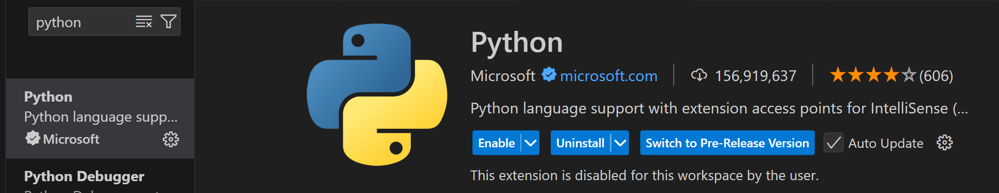
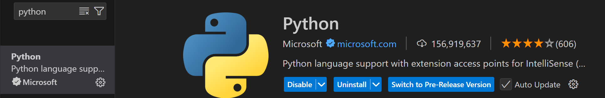
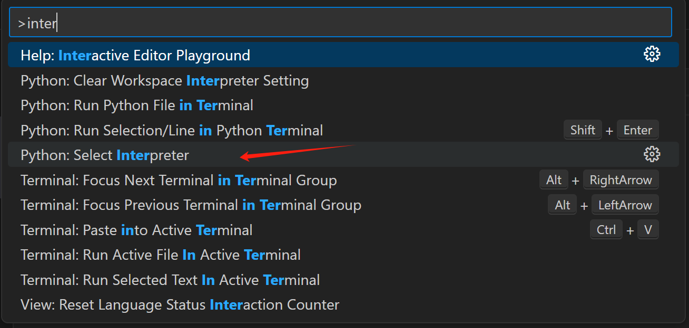
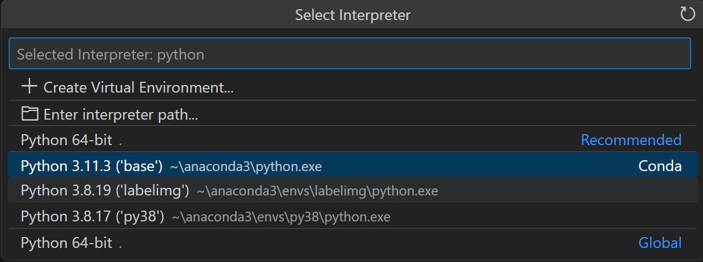
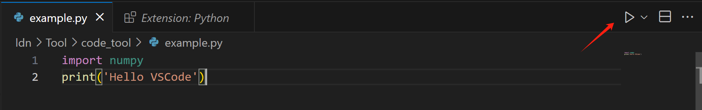
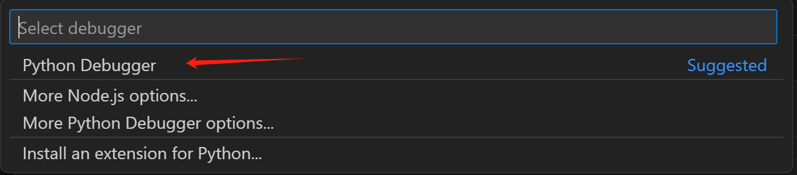

## VS Code 环境配置

### 一、Python 解释器配置

#### 1.下载python扩展

若Disable则改为Enable

#### 2.配准python解释器

ctrl+shift+P调出命令面板，找到Python:select interpreter

会自动识别系统已有的python（有不同版本），选择需要的版本；如果没有自动识别（比如python2.x），手动输入/选择解释器的系统路径

点击运行，或快捷键ctrl+F5

### 二、C++配置运行环境

[VS Code 配置 C/C++ 编程运行环境（保姆级教程）_vscode配置c++环境-CSDN博客](https://blog.csdn.net/qq_42417071/article/details/137438374)