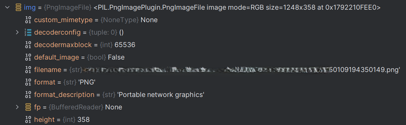
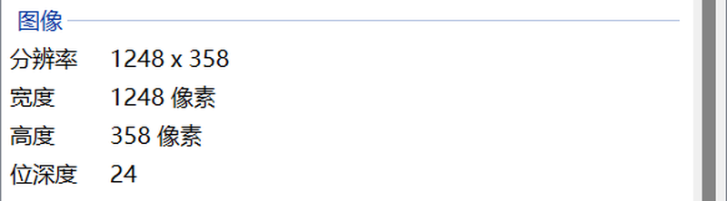
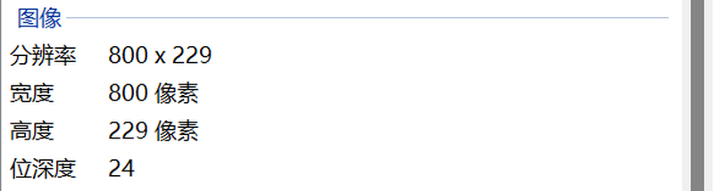

## 调整图片像素大小

```python
# 调整图片大小的脚本
from PIL import Image
import os


# 方法1：同时指定宽度和高度
def image_size(image_directory, output_directory, width_height):
    # 输入路径不存在
    if len(os.listdir(image_directory)) == 0:
        print('该路径不存在，请重新指定文件。')
        return 0
    # 如果输出文件夹不存在，创建输出路径
    if not os.path.exists(output_directory):
        os.mkdir(output_directory)

    # 遍历文件中的每一张图片
    for file_name in os.listdir(image_directory):
        if file_name.lower().endswith(('.png', '.jpg', '.jpeg')):
            # 打开图片
            with Image.open(os.path.join(image_directory, file_name)) as img:
                # 调整图片大小
                resized_img = img.resize(width_height)
                # 按原文件名输出图片
                resized_img.save(os.path.join(output_directory, file_name))

    print('所有图片已调整像素大小并保存在', output_directory)


# 方法2：仅指定宽度，高度按比例调整
def image_size_width(image_directory, output_directory, new_width):
    # 输入路径不存在
    if len(os.listdir(image_directory)) == 0:
        print('该路径不存在，请重新指定文件夹。')
        return 0
    # 如果输出文件夹不存在，则创建它
    if not os.path.exists(output_directory):
        os.makedirs(output_directory)

    # 遍历文件夹中的文件
    for file_name in os.listdir(image_directory):
        if file_name.lower().endswith(('.png', '.jpg', '.jpeg')):
            # 打开图片文件
            with Image.open(os.path.join(image_directory, file_name)) as img:
                if img.size[0] == new_width:
                    continue
                # 计算新的高度，保持宽高比
                width_percent = (new_width / float(img.size[0]))
                new_height = int((float(img.size[1]) * float(width_percent)))
                # 调整图片大小
                img = img.resize((new_width, new_height), Image.LANCZOS)
                # 保存调整后的图片
                img.save(os.path.join(output_directory, file_name))

    print('所有图片已按比例调整宽度并保存在', output_directory)


if __name__ == '__main__':
    images_path = r'D:\images'
    output_path = r'D:\images'
    image_size_width(images_path, output_path, new_width=800)
    # image_size(images_path, output_path, width_height=(800, 600))
```

图片信息






