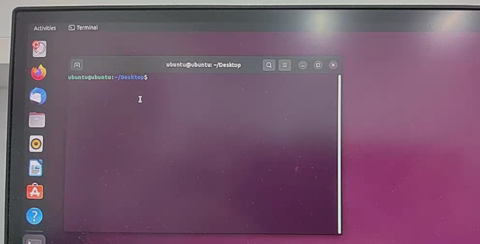
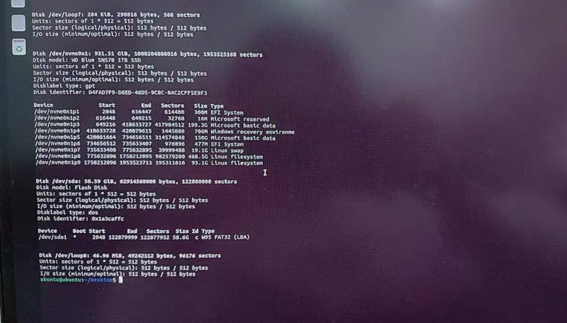

<!-- 说明 -->
- **Ubuntu踩坑记录**

## Ubuntu 查看磁盘情况

### 1. 用Ubuntu启动U盘进入Ubuntu安装界面

### 2. 进入命令行查看磁盘情况

**sudo fdisk -l**

查看磁盘情况

列出磁盘详细信息

查看磁盘内存

**sudo  mount  /dev/nvme0n1p1   /mnt   -v**

查看磁盘p1的情况

**find /mnt**

**ls /mnt**

同理，查看p6的情况

**sudo  mount  /dev/nvme0n1p6   /media  -v**

**ls /media**

**sudo gparted**

