<!-- 目录 -->
- **Windows 234**

## Windows 引导项问题

### 1. Windows引导修复软件

#### 1.1 制作U盘教程 

用另外好的电脑和空U盘下载制作U盘工具

先退出电脑上所有杀毒（360 电脑管家等）然后按教程操作

[软件下载网站](zyz.lanzn.com/iHxWe2chwbhc)

[相对路径：在当前域名后添加括号中的内容](ldn/)

这个是制作U盘的工具，浏览器下载

- 把这个文件下载到电脑里（不要下载到U盘）

- 重要提示U盘必须是空的  因为制作过程会格式化U盘

- 然后打开制作U盘工具选一键制作，再选仅制作启动U盘

制作完成后会有完成弹窗

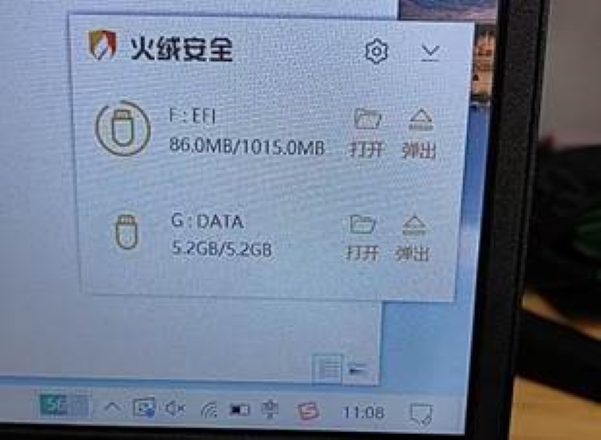

#### 1.2 大白菜windows pe 维护U盘制作

[大白菜启动U盘下载网址](http://dbc.windowsrw.cn/)

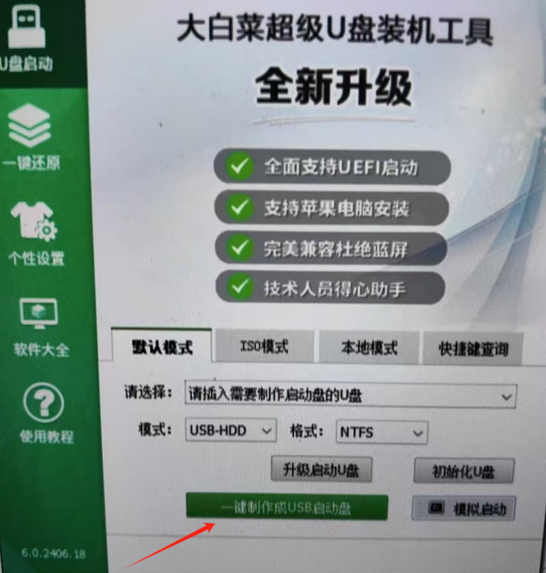

操作指南

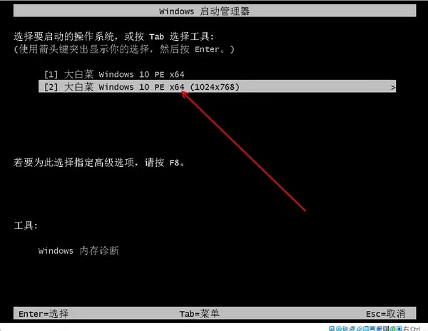

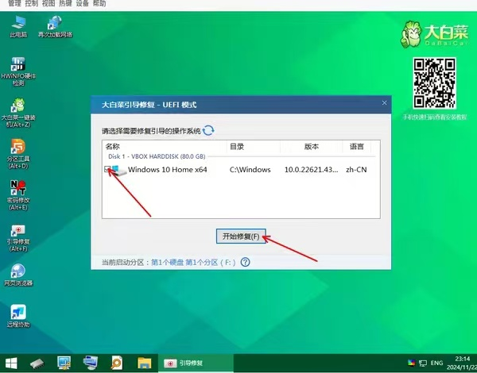

下载后U盘中的文件

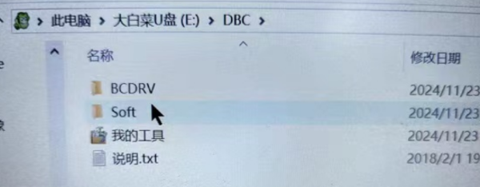

插上主机按F8进入Bios

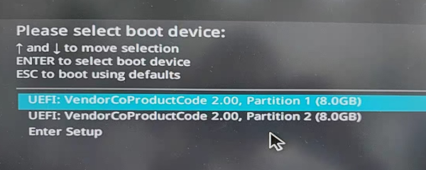

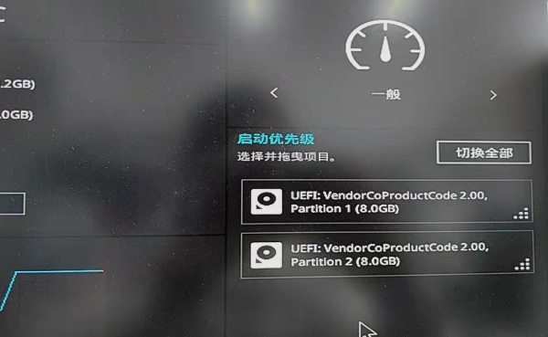

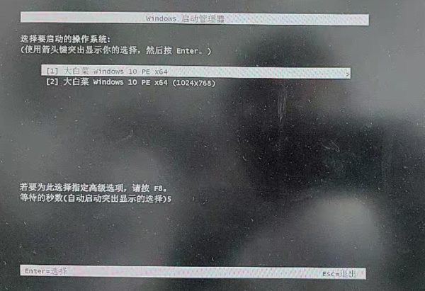

双击引导修复勾选需要修复的系统进行修复

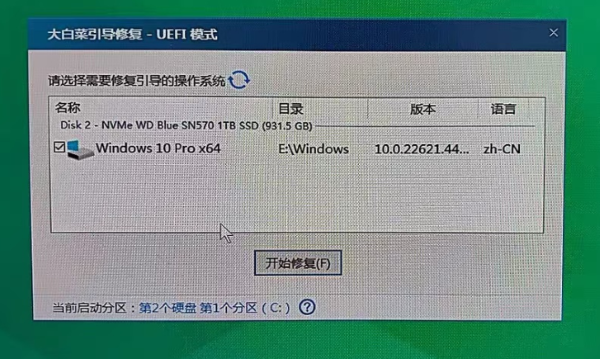

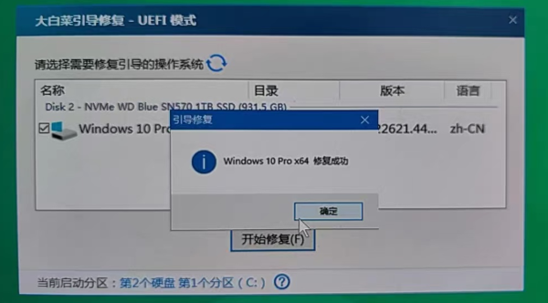

### 2. 从Bios进入windows系统

之前已经制作过了大白菜U盘，完成了引导项修复

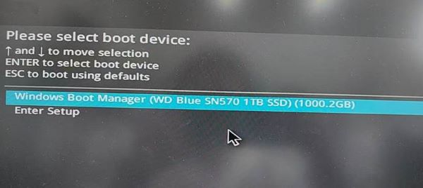

连续按F8 进入Windows

按F7进入高级模式

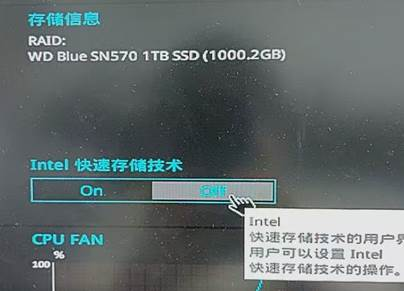

快速储存技术选项（这个很重要，原理不清楚，但是不能随意切换一般是off）

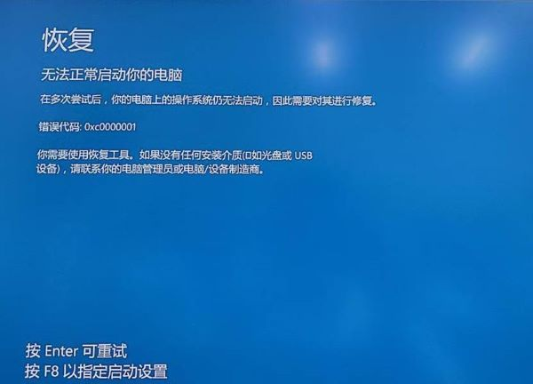

这个启动不了就是快速储存技术的锅

 